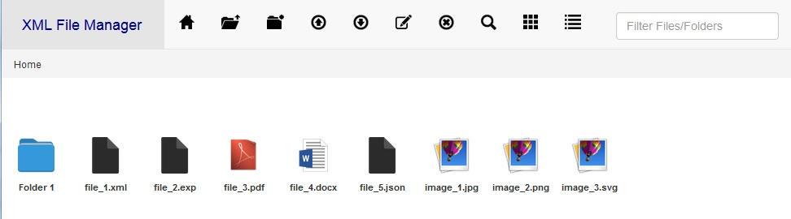

# mh_xml_filemanager

App uses jquery-file-manager plugin and XMLTree plugin to manage and display .xml and .exp files.

<h4>jquery-file-manager plugin:</h4>

https://github.com/MicroHealthLLC/mh_xml_filemanager/blob/master/README_filemanager.md

<h4>XMLTree plugin:</h4>

https://github.com/koppor/xmltree 
https://github.com/MicroHealthLLC/mh_xml_filemanager/blob/master/README_xmltree.md 
https://github.com/MicroHealthLLC/mh_xml_filemanager/blob/master/LICENSE_xmltree

<h4>Install</h4>
<ol>
<li>Install nodejs</li>
<li>Download source code from https://github.com/MicroHealthLLC/mh_xml_filemanager; unzip and place folder in desired location</li>
<li>Using the command prompt, change directory to folder location; npm start</li>
<li>Open a browser and connect to http://localhost:3000</li>
</ol>

